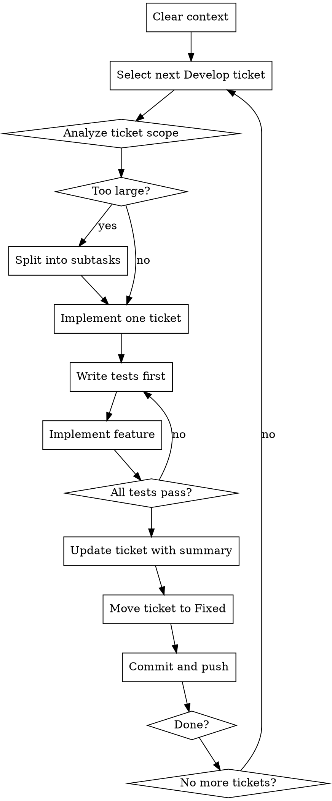

# YouTrack Ticket Workflow

## Overview

Process YouTrack tickets sequentially from the "Develop" State in project OXI, implementing changes with best practices and testing, then updating tickets to "Fixed" State with git commits. 


## When to Use

- Working on oxidize project (YouTrack project: OXI).
- Tickets are in "Develop" State
- Need to implement, test, commit, and update ticket status
- Clear or compact context after finishing a ticket, but before starting a new ticket.

## Project Mapping

| Local Folder | YouTrack Project |
|--------------|------------------|
| . | OXI |

## Workflow



## Implementation Steps

### 1. Clear Context
Start fresh for each ticket to avoid cross-contamination of requirements.

### 2. Select Ticket
- Query YouTrack for tickets in "Develop" State
- Only process OXI tickets for oxidize project

### 3. Analyze Scope
- Read ticket description and acceptance criteria
- Determine if ticket is appropriately scoped
- **If too large:** Create subtasks in YouTrack, then work on subtasks individually

### 4. Implement with TDD
- Write failing tests first
- Implement minimal code to pass tests
- Refactor while keeping tests green
- Ensure all tests pass before proceeding

### 5. Update Ticket
- Add summary of changes made
- Include files modified and key implementation details
- Move ticket to "Fixed" State

### 6. Git Commit
- Write concise commit message referencing ticket number
- Example: `OXI-123: Implement user authentication endpoint`
- Push changes to remote

### 7. Do another ticket
- Take another ticket. Keep going until all tickets for all projects are done. 
- Avoid having to ask for human input if possible to continue on your own

## Common Mistakes

| Mistake | Fix |
|---------|-----|
| Working on multiple tickets simultaneously | Complete one ticket before moving to next |
| Skipping tests | Always use TDD - tests first, then implementation |
| Not splitting large tickets | Create subtasks for tickets that are too complex |
| Vague commit messages | Include ticket number and specific change description |
| Failed tool call | analyze the failure, update own documentation to prevent in future |
| Looping on tool call | If doing same tool call more than 5 times, stop and triage issue. Update documentation |

## Quick Reference

```bash
# Query Develop State tickets (example)
# OXI tickets for oxidize

# Commit format
git commit -m "PROJ-NNN: Concise description of change"
git push
```
